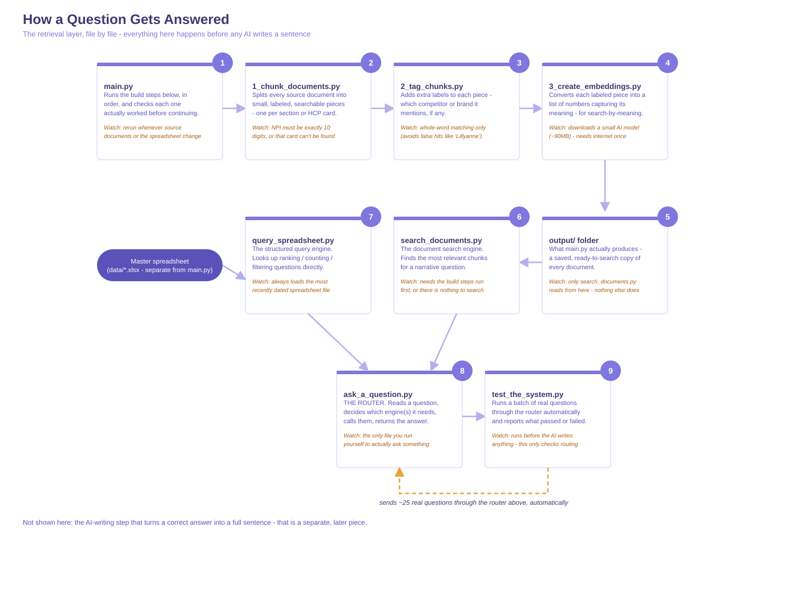

# Rabivy Commercial AI Engine - Project Scope

## Overview

This document outlines the architecture and phased build plan for an AI-powered commercial intelligence platform for Rabivy. The system allows AX Pharmaceuticals commercial users to ask natural-language questions (e.g. "Who are the top GLP-1 prescribers in NY?") and receive accurate, data-backed answers.

The platform combines several components into a single retrieval-driven system, connected by a conversational interface.

Disclaimer:

Rabivy and AX Pharmaceuticals are fictional and were created solely for the purposes of this demonstration and portfolio project. This project is an independent demonstration and was not commissioned by any pharmaceutical company.
---

## Architecture Summary

| Phase | Component | Status |
|---|---|---|
| 1 | GTM Strategy | Complete |
| 2 | Propensity Model | Complete (synthetic data) |
| 3 | Knowledge Repository | Complete (synthetic data) |
| 4 | Retrieval Layer (RAG) | Complete (still debugging) |
| 5 | AI Evaluation Layer | Not started |
| 6 | Conversational Interface | Not started |

To Do:
Ground Truth Question 20 issue: This question routes to RAG and does a single search using the whole question as the query. That search finds state_market_summary__new_york — a document that's purely targeting data (prescriber lists, volumes, propensity). It contains nothing about messaging, competitive positioning, or talking points at all. So the AI genuinely only has half the ingredients — it can't "tap into key facts that make Rabivy better" because those facts were never retrieved in the first place. It's not an AI reasoning failure; it's a retrieval gap, same category as "didn't compare" was.

**Figure 1: Project Pipeline**

---

## Phase 1: GTM Strategy

Defines the commercial logic the platform is built to support.

- Target HCP segments (Untreated High-Need, Re-Engagement/Lapsed, Competitive Switchers, Weight Maintenance)
- Clinician targeting criteria
- Competitive positioning relative to the GLP-1 class
- Success metrics

This content is later ingested into the knowledge repository (Phase 3) as a source document set.

---

## Phase 2: Propensity Model

A predictive scoring model that ranks HCPs by likelihood to prescribe Rabivy. Built as a literature-weighted scorecard across nine variables (Rx volume, payer mix, formulary tier, prior authorization burden, existing AX Pharmaceuticals relationship, etc.), conditioned on specialty.

- **Current state:** built using synthetic dataset
- **Required for production:** rebuild on licensed prescriber data, with scoring logic unchanged
- **Function in the platform:** a queryable data source, not a document - the model output is retrieved by the system, not generated by the language model

---

## Phase 3: Knowledge Repository

The data foundation. Establishes what information exists and where it lives, prior to any retrieval system being built.

**Structured data:**
- Prescriber-level Rx/NRx data (IQVIA Xponent, Symphony Health, Komodo)
- HCP reference data — NPI, specialty, location, decile
- Payer and formulary coverage data
- Propensity scores (Phase 2)
- Rep activity and call history (Veeva CRM)

**Unstructured data:**
- GTM strategy documents (Phase 1)
- Brand plans and positioning materials
- Competitive intelligence
- Clinical publications
- Market access documentation

**Required first step:** a source inventory - an audit of every available source, its owner, format, and update frequency.

---

## Phase 4: Retrieval Layer (RAG)

The component connecting the knowledge repository to the language model. Retrieval-augmented generation ensures the system answers from verified company data rather than the model's training data.

This phase has two distinct retrieval paths, plus routing and synthesis logic connecting them.

### 4.1 Structured Query Engine
Handles ranking and lookup questions over tabular data (e.g. "top prescriber in NY"). Converts the question into a database query - filter, sort, return - guaranteeing a factually correct result rather than an inferred one.

### 4.2 Document Search Engine
Handles conceptual or narrative questions where the answer is contained in written material rather than a single data point. Pipeline:

1. Text extraction from source documents (PDF, PPTX, etc.)
2. Chunking - splitting documents into retrievable segments
3. Embedding - converting each chunk into a vector representation
4. Storage in a vector database for semantic search

**Chunking strategy:** documents must be segmented along topic boundaries (e.g. patient selection, competitive landscape, access barriers as separate chunks), not by fixed length. Chunking quality has a greater impact on retrieval accuracy than the choice of underlying language model.

**Metadata tagging:** each chunk is tagged with attributes (brand, geography, audience, source type, date) to allow filtering prior to semantic search.

### 4.3 Query Router
Classifies each incoming question and directs it to the structured query engine, the document search engine, or both. Routing accuracy is a primary determinant of overall system reliability.

### 4.4 Answer Synthesis
The language model's role is restricted to formatting retrieved information into a natural-language response. The model does not generate facts, scores, or rankings - these are supplied by Phases 2 and 4.1–4.2.

### 4.5 Multi-source queries
Some questions require combining outputs from multiple sources in a single response (e.g. "who should I target next month?" draws on current Rx data, propensity scores, and GTM guidance simultaneously).

### 4.6 Retrieval Evaluation
Retrieval accuracy is tested against a set of questions with known correct answers and sources, measuring precision, recall, relevance, and hallucination rate.

---

### Implementation Reference: Build Scripts vs. Tool Scripts

**Figure 2: How the various files work together**

 
The current codebase implementing Phase 4 is organized into two categories of scripts, each with a different execution model. This section maps the phases above to the actual files.
 
#### Build scripts (run once, in order, produce output)
 
These scripts process the knowledge base and save their results to disk. Each one depends on the previous step's output, so they must run in this exact sequence:
 
1. **`1_chunk_documents.py`** - splits source documents into labeled, retrievable segments (Phase 4.2, chunking)
2. **`2_tag_chunks.py`** - adds metadata tags such as competitor and brand mentions to each segment (Phase 4.2, metadata tagging)
3. **`3_create_embeddings.py`** - converts each tagged segment into a vector representation for semantic search (Phase 4.2, embedding)
**`main.py`** runs all three automatically, in the correct order, checking after each step that it actually produced valid output before continuing. This is the one file that should be run to rebuild the knowledge base after the source documents or master spreadsheet change.
 
#### Tool scripts (run on demand, answer one question at a time)
 
These scripts do not produce new output on disk. Each one answers a specific question when called:
 
- **`query_spreadsheet.py`** - the structured query engine (Phase 4.1). Looks up ranking, counting, and filtering questions directly against the master spreadsheet.
- **`search_documents.py`** - the document search engine (Phase 4.2). Retrieves the most relevant document segments for a given narrative question.
- **`ask_a_question.py`** - the query router (Phase 4.3). Determines whether a question needs the structured engine, the document engine, or both, and returns the answer.
- **`test_the_system.py`** (Phase 4.6) is a partial exception: rather than requiring a specific question, it runs a fixed bank of real test questions through the router automatically and reports whether each one succeeded. It is currently run as a separate, explicit step after `main.py`, to confirm the rebuilt knowledge base is working correctly end to end.

---

## Phase 5: AI Evaluation Layer

A governance layer that validates system outputs on an ongoing basis, not only at launch.

- Maintains a bank of test questions with known correct answers
- Runs automatically whenever the underlying data or models change
- Tracks accuracy and hallucination rate over time

This phase is conceptually aligned with the existing AIML evaluation workstream.

---

## Phase 6: Conversational Interface

The user-facing layer. Functions as follows:

1. Receives the user's question
2. Passes it to the query router (Phase 4.3)
3. Retrieves the relevant fact(s) from the structured or document engine
4. Validates output against the evaluation layer (Phase 5)
5. Returns a natural-language response

**Example output:**
> "Dr. B is currently the third-highest GLP-1 prescriber in your territory but has the highest Rabivy adoption propensity score (87/100). Recommended messaging focus: long-term weight maintenance and unmet patient need."

---

## Implementation Sequence

1. **Source inventory** - catalogue all available data sources, documents, models, and dashboards, with owner, format, and update frequency
2. **Question taxonomy** - define the categories of questions the system must answer (lookup, predictive, strategic, narrative); this determines routing design
3. **Knowledge structuring** - define chunking and metadata approach prior to ingestion
4. **Pipeline build** - implement document processing (extraction, chunking, embedding, storage) and structured query engine in parallel
5. **Evaluation harness** - build ground-truth test sets and accuracy tracking
6. **Conversational interface** - final layer, built once retrieval and evaluation are validated

---
