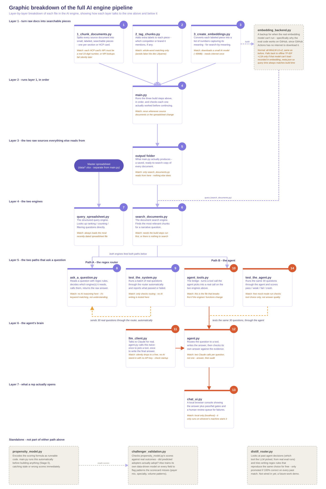

# Rabivy AI Engine

## What this is

This is a natural-language question-answering tool for a pharmaceutical sales team. A rep can ask something like *"Who should I target next month in New York, and what should I say to them?"* and get back a real, data-grounded answer - not a guess, and not something the AI made up.

It works two ways, both included in this repo:

- **A fast, free, deterministic router** - handles a question by matching keywords with regex, then calling one of two engines directly. No AI involved in the routing itself, so it's instant and costs nothing to run.
- **An AI agent** - actually understands the question, decides which tool(s) to call (possibly several, chained together), and writes a real answer in its own words - while still only ever using real numbers pulled from the two engines, never inventing one.

Both paths share the exact same two underlying engines, so neither one can drift out of sync with what the data actually says.

**Disclaimer:** Rabivy and AX Pharmaceuticals are fictional, created solely for this demonstration/portfolio project. Not commissioned by any pharmaceutical company. For the original project plan this was scoped against, see [PROJECT_BRIEF.md](PROJECT_BRIEF.md).

For a full write-up of the project - the architecture, the design decisions, and why it's built the way it is - see the [Project Write-Up](https://ax-consult-group.github.io/medical-Rabivy-AI-engine/index.html).

For a full walkthrough of how this whole system is tested - the golden question set, live ground truth, and every evaluation described below, including the real bugs each one found - see the [Evaluation Suite](https://ax-consult-group.github.io/medical-Rabivy-AI-engine/evals.html) write-up.

---

## The full pipeline, visually



Every file below is arranged in layers - each layer only ever talks to the layer directly above or below it. Read top to bottom.

*(Note: the schematic above reflects the architecture as of the last diagram update - the evaluation layer described below has since grown further (a shared ground-truth module plus a second, article-specific eval track); the diagram itself hasn't been redrawn to match yet.)*

---

## Layer by layer

**Layer 1 - turns raw documents into searchable pieces.** Three scripts run once, in order, to prepare the knowledge base: `1_chunk_documents.py` splits every source document into small, labeled pieces (one chunk per section or HCP card); `2_tag_chunks.py` adds extra labels to the chunks so they are easily traceable; `3_create_embeddings.py` converts each piece into a vector of numbers that captures its meaning, so the system can search by meaning, not just keywords.

**Layer 2 - the orchestrator.** `main.py` runs all three Layer 1 steps in the correct order, checking after each one that it actually worked before moving on. This is the one file to run to rebuild the knowledge base from scratch.

**Layer 3 - the two raw sources everything else reads from.** The `output/` folder is what `main.py` actually produces - a saved, ready-to-search copy of every narrative document (Layer 1). The master spreadsheet (`data/*.xlsx`) is a separate source entirely, holding the real HCP-level prescribing and propensity data.
 
In a real deployment, both of these would be built from bought and licensed data, not typed by hand:
 
- **The spreadsheet's structured fields** would typically come from vendors like IQVIA (Xponent, OneKey), Symphony Health, or Komodo Health for prescribing volume and payer mix, plus Veeva CRM for rep activity and call history - each HCP record merged together by NPI (National Provider Identifier), the one ID that's consistent across every source.
- **The narrative documents Layer 1 chunks up** would be the unstructured side: clinical trial write-ups and publications, conference proceedings and poster presentations, competitive intelligence briefs, rep talking points and objection-handling guides, and payer/drug-benefit coverage documents.

In this project, all of the above is synthetic data generated to look like the real thing, not actual licensed data.

**Layer 4 - the two engines.** `query_spreadsheet.py` is the structured query engine - it answers ranking, counting, and filtering questions by looking directly at the spreadsheet. `search_documents.py` is the document search engine - it finds the most relevant chunks for a narrative question, using whichever embedding model built the store (see `embedding_backend.py` below).

**Layer 5 - the two paths that actually ask a question.** This is where the two approaches diverge, both sitting on the exact same Layer 4 engines underneath:
- **Path A, the regex router:** `ask_a_question.py` reads a question with keyword/regex rules, decides which engine(s) it needs, calls them, and returns the raw answer - no real understanding, just pattern matching. `debugger_agent.py` is not part of this live path - it's a standalone stress-testing tool from earlier iterations, used to synthesize narrative-style answers over Path A's retrieved data via a small, free API (Groq), specifically to exercise the regex router's narrative-answer cases under something closer to real conditions before Path B (the agent) existed to do that job properly.
- **Path B, the agent:** `agent_tools.py` is the bridge that turns a tool call the agent picks into a real call on the two engines above. Includes `aggregate_hcp_stats`, a dedicated tool that computes a true average, percentage, sum, or difference directly over every matching row - added after testing found the agent either guessing from a capped 25-row sample, or correctly refusing to answer, whenever a question asked for a statistic across a larger group than that.

**Layer 5 (evaluation) - does either path actually work?** Rebuilt this cycle around a single 30-question golden set, checked on **three separate layers** per question rather than one pass/fail: did it route to the right engine, did it apply the right rules/filters to get there, and does the answer match reality - computed **live** against the actual spreadsheet each run, so a data refresh moves the expected answer automatically instead of a test going stale.
- `ground_truth.py` - shared module every eval file imports: computes live answers directly from the real data functions, and holds a small, source-verified table of facts for narrative questions. One source of truth, so the eval files can't drift apart from each other.
- `test_the_system.py` - runs the 30 questions through Path A, all three layers.
- `test_the_agent.py` - runs the same 30 questions through Path B, all three layers; tool selection and arguments checked always, answer quality and audit verdict checked only with a live model.
- `test_phrasing_consistency.py` - takes 10 of the 30 questions and re-runs each one with 2 genuinely different rephrasings, reusing the exact same three-layer checks - checks whether the system still gets it right when a rep doesn't ask in the exact golden-set wording.
- `test_retrieval_ranking.py` - calls the document search engine directly (no LLM, so it's free to run) and checks whether the correct chunk for each narrative question is ranked **first**, not just present somewhere in the results - a stricter check than anything above, since the model weighs whatever's ranked first most heavily.
- `test_numeric_accuracy.py` - checks the agent's own computed math (a percentage, an average, a sum, a difference between two groups, a compound calculation) against a live, full-precision ground truth, with no rounding tolerance - a different question from whether the underlying data is right, since this is about whether the agent's own arithmetic on top of that data is right too.

**A second, article-specific eval track** runs the same three-layer idea against real, published journal articles that were ingested and chunked through the normal Layer 1 pipeline like any other document, then tested exactly like the simulated documents above - purpose-built to check the system's ability to handle genuine, unsimplified information, not content written to be easy to retrieve:
- `article_ground_truth.py` - same live-lookup principle as `ground_truth.py`, but for real papers: finds each fact's chunk by searching `chunks_tagged.json` for a distinctive substring, never a hardcoded chunk ID. Includes a deliberate cross-document trap - two different papers state different specifics about the same general topic (GLP-1 receptor location in the kidney), testing whether retrieval and synthesis attribute the right claim to the right paper instead of blending them.
- `test_article_retrieval.py` - calls the real search engine directly (free, no LLM) and checks whether each article question's correct chunk ranks first, searching the **full corpus** (every doc type, not a pre-filtered article-only subset) so retrieval competes against the same real noise a rep's question would.
- `test_the_articles.py` - runs the same questions through the real agent, three layers, same matching method as `test_the_agent.py`. Real papers add a genuine ambiguity single-source questions above don't have: Claude may already know a fact from pretraining, so a retrieval-FAIL-but-answer-PASS result is flagged for a manual pretraining-recall check rather than trusted outright.

**Layer 6 - the agent's brain.** `llm_client.py` is the actual interface to Claude - `agent.py` calls it twice per question, once to pick a tool, once to write the final answer. Uses the real API if a key is set, otherwise a free, offline stand-in with no AI at all, for zero-cost testing. `agent.py` itself is the orchestrator: it runs the tool-selection loop, writes the answer, then runs a separate audit pass checking its own answer against the evidence before returning it, revising once if the audit fails.

**Layer 7 - what a rep actually opens.** `chat_ui.py` is a local web interface showing the answer plus the tool trace and audit verdict alongside it, so nothing is a black box.

**Standalone - real, but not part of either path above.** `propensity_model.py` encodes the scoring formula as runnable code; `main.py` runs it automatically before building anything (Stage 0), so a stale or wrong score gets caught immediately rather than silently flowing downstream. `challenger_validation.py` checks `propensity_model.py`'s scores against real (or simulated) outcomes, and separately trains its own data-driven model to flag patterns the hand-built scorecard might be missing. `distill_router.py` is an experiment: it looks at the agent's own past tool-choice decisions and tries writing free regex rules that would reproduce them, promoting a rule only if it's 100% correct on every past match - not wired into `chat_ui.py` yet. `intel_digest.py` is a separate loop entirely: turns a batch of incoming external signals (conference abstracts, publications, regulatory readouts, payer/market news) into a ranked, email-ready briefing, then ingests the items into the knowledge repository so the conversational agent can answer questions about them afterwards - feed, triage, digest, ingest.

---

## Every file, in one table

| File | Layer | What it does |
|---|---|---|
| `1_chunk_documents.py` | 1 | Splits source documents into small, labeled, searchable pieces |
| `2_tag_chunks.py` | 1 | Adds competitor/brand tags to each piece |
| `3_create_embeddings.py` | 1 | Converts each piece into a vector for meaning-based search |
| `main.py` | 2 | Runs the whole build pipeline, in order, with checks |
| `output/` folder | 3 | What `main.py` produces - the saved, searchable documents |
| `data/*.xlsx` (master spreadsheet) | 3 | The real HCP prescribing/propensity data |
| `query_spreadsheet.py` | 4 | Structured engine - ranking, counting, filtering |
| `search_documents.py` | 4 | Document engine - meaning-based search over chunks |
| `ask_a_question.py` | 5 (Path A) | Regex router - no AI, keyword matching only |
| `debugger_agent.py` | 5 (Path A) | Standalone stress-test tool from earlier iterations - synthesized narrative answers over Path A via a free API (Groq), not part of the live path |
| `agent_tools.py` | 5 (Path B) | Bridges the agent's tool calls to the two real engines, incl. `aggregate_hcp_stats` |
| `ground_truth.py` | 5 (eval) | Shared live-answer computation + verified narrative facts, used by every eval file below |
| `test_the_system.py` | 5 (eval) | Runs the 30 golden questions through Path A, 3-layer scoring |
| `test_the_agent.py` | 5 (eval) | Runs the same 30 questions through Path B, 3-layer scoring |
| `test_phrasing_consistency.py` | 5 (eval) | Re-runs 10 of the 30 questions with genuine rewordings |
| `test_retrieval_ranking.py` | 5 (eval) | Checks the correct chunk is ranked #1, not just present |
| `test_numeric_accuracy.py` | 5 (eval) | Checks the agent's own computed math against live ground truth |
| `article_ground_truth.py` | 5 (eval, articles) | Live-lookup ground truth for real published papers, incl. a deliberate cross-document trap |
| `test_article_retrieval.py` | 5 (eval, articles) | Checks real-paper chunk ranking against the full corpus, not a pre-filtered subset |
| `test_the_articles.py` | 5 (eval, articles) | Runs the real-paper questions through the real agent, 3-layer scoring, pretraining-recall flagging |
| `llm_client.py` | 6 | The real interface to Claude (or a free offline stand-in) |
| `agent.py` | 6 | Orchestrator - tool loop, answer synthesis, self-audit |
| `chat_ui.py` | 7 | Local web interface showing the answer plus its evidence |
| `embedding_backend.py` | standalone | Shared fallback so build and query never use mismatched embedding models |
| `propensity_model.py` | standalone | The scoring formula as code; guards `main.py` against stale scores |
| `challenger_validation.py` | standalone | Checks the scorecard against real outcomes and a learned model |
| `distill_router.py` | standalone | Experiment: turns the agent's own past decisions into free regex rules |
| `intel_digest.py` | standalone | Competitive intelligence loop - feed, triage, digest, ingest |
| `build_dashboard.py` | standalone | Reads `eval_runs/` + the live query/RLHF logs, writes the maintenance dashboard (`dashboard.html`) |

---

## Running it

```bash
pip install -r requirements.txt
```

**1. Build the knowledge base - essential, always run this first.**

```bash
python main.py
```

Chunks, tags, and embeds every source document, and builds the propensity/switching scores. Nothing else in this repo works until this has run at least once - it's a one-time build step, not something you run per question.

**2. Get an API key - needed for a real demo.**

```bash
export ANTHROPIC_API_KEY=...            # Windows: set ANTHROPIC_API_KEY=...
```

Without a key, the agent falls back to a free, offline stand-in with no real AI in the loop - fine for confirming the plumbing works, not what you want for an actual demo.

**3. Demo it - essential, pick whichever you want to show.**

```bash
python agent.py                                                                                  # interactive console session - plain terminal, VS Code, wherever
python agent.py "Who should I target next month in New York, and what should I say to them?"     # one-shot, no session
python chat_ui.py                                                                                 # the actual rep-facing chat UI, at http://localhost:8017
```

`agent.py` is the fastest way to just ask it something directly from the console. `chat_ui.py` is the real interface - use that one if you're showing the product itself rather than the underlying logic.

**4. Run the evals - optional, uses API credits.**

```bash
python test_the_system.py               # test Path A - the regex router (free, no API key)
python test_the_agent.py                # test Path B - the agent (free in mock mode, no API key needed)
python test_phrasing_consistency.py     # does rewording a question change the answer? (free in mock mode)
python test_retrieval_ranking.py        # is the right document chunk ranked #1? (always free, no LLM used)
python test_numeric_accuracy.py         # is the agent's own maths correct? (needs a live model to mean anything)
python test_article_retrieval.py        # same ranking check, against real published papers (always free, no LLM)
python test_the_articles.py             # same 3-layer check, against real published papers (free in mock mode)
```

Not needed to demo the product itself - these check whether it's actually working, and each run writes a fresh results file to `eval_runs/`. `test_retrieval_ranking.py` and `test_article_retrieval.py` never touch the LLM at all, so those two are always free regardless of whether a key is set.

**5. Build the dashboard - optional, run this last, after the evals.**

```bash
python build_dashboard.py
```

Reads whatever's currently sitting in `eval_runs/`, plus the live query/RLHF logs, and writes `dashboard.html`. Run the evals (step 4) first if you want the dashboard's golden-test numbers to reflect a current run - this script only reads what's already there, it doesn't run anything itself.

---

`test_the_agent.py` and `test_phrasing_consistency.py` run in one of two modes automatically, depending on whether a key is set:
- **Mock mode** (no key) - free, deterministic, checks tool selection and retrieval only - a real, but weaker, signal.
- **Real mode** (key set) - additionally checks answer quality and the audit verdict, using the real model.

CI (`.github/workflows/eval.yml`) runs the full build plus `test_the_system.py` and `test_the_agent.py`, in mock mode, on every push and pull request - so a change that breaks routing, retrieval, or the agent loop turns the commit red before it reaches anyone. It also runs `challenger_validation.py`'s model-gap digest.

---

## Current status / known limitations

- **The embedding model sometimes misses the right chunk, or ranks a worse one above it.** Confirmed directly by `test_retrieval_ranking.py` against the real embedding model: 4 of 10 narrative questions didn't rank their correct chunk first, and one didn't retrieve it at all even with a well-formed query. This is a genuine limitation of the embedding model itself (`all-MiniLM-L6-v2`), not a routing or prompting problem - the real fix (hybrid keyword + semantic search) is a larger piece of work, deliberately not undertaken for this showcase.
- **`distill_router.py` is a real experiment, not live** - it isn't wired into `chat_ui.py`, so it doesn't affect what a rep actually sees today.
- Both Path A and Path B sit on the same Layer 4 engines - a change to those engines affects both, so both are kept in sync deliberately, not by accident.

---

## Attribution

Phases 1-4 (knowledge repository, propensity model, structured and semantic retrieval engines, the regex router and its evaluation) and Phases 5-6 (the agentic layer, evaluation harness, and conversational interface) were both built as part of this project, by collaborators working on their own layers of the same system - see commit history for the detailed timeline. The regex router (Path A) and the agent (Path B) were deliberately kept as two separate, comparable paths over the same underlying engines, rather than one replacing the other.